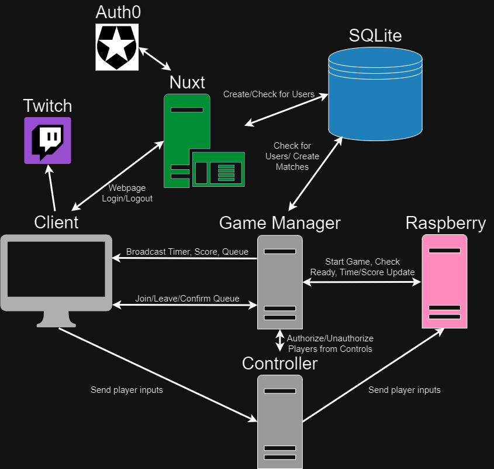
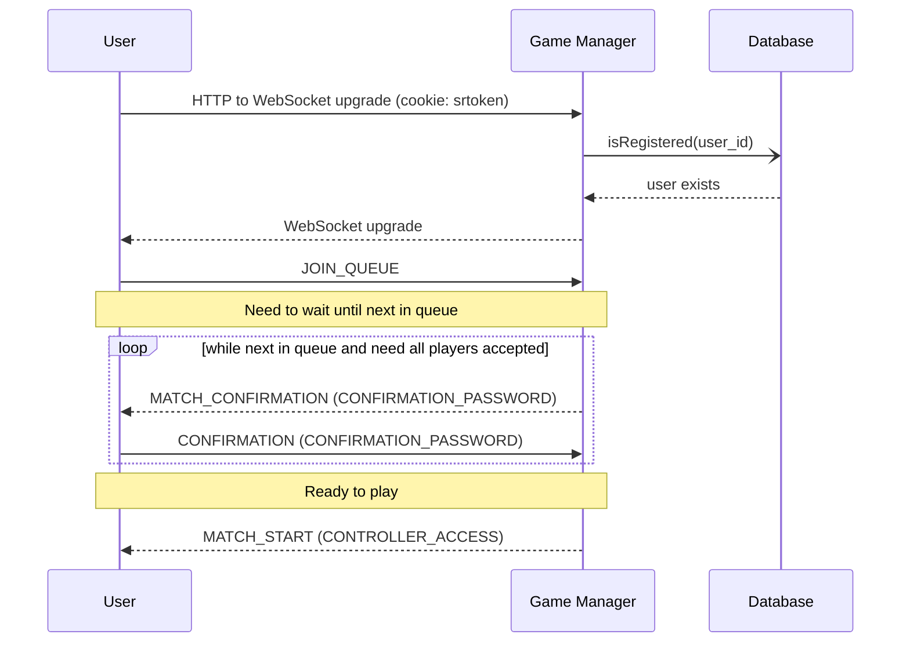

# Documentation

Useful documentation

<!-- markdownlint-disable-next-line MD033 -->

<h2>Table of Contents</h2>

- [System Architecture](#system-architecture)
- [Flow Charts](#flow-charts)
- [Sequence Diagrams](#sequence-diagrams)

## System Architecture

## Flow Charts

### Game Cycles

## Sequence Diagrams

### Queue Interaction

