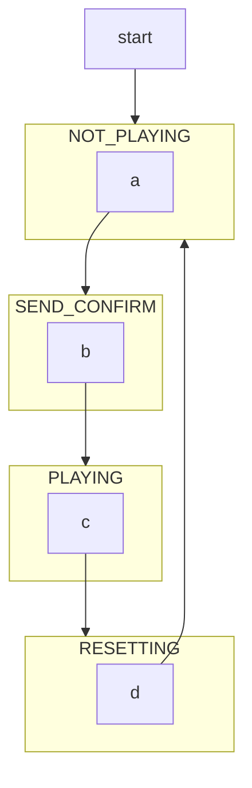
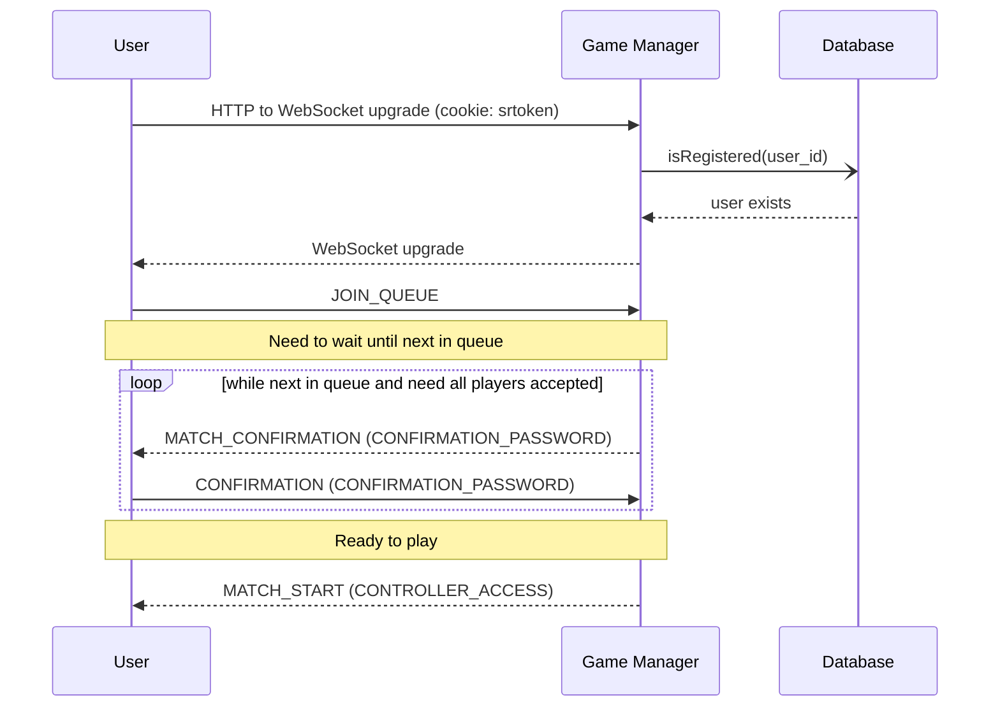

# Documentation

Useful documentation

<!-- markdownlint-disable-next-line MD033 -->
<details><summary><h2>Table of Contents</h2></summary>

- [System Architecture](#system-architecture)
- [Flow Charts](#flow-charts)
- [Sequence Diagrams](#sequence-diagrams)

</details>

## System Architecture


### Webpage, Login/Logout

```text
Nuxt handles serving the webpage as well as handling login/logout through Auth0, registering new users in the database.
```

### Broadcast Timer, Score, Queue

```text
Server: Game Manager
Server-sent events that update all clients about the current time, scores, and queue list.
```

### Join/Leave/Confirm Queue

```text
WebSocket Server: Game Manager
Game Manager authenticates HTTP upgrade and handles joining/leaving queue requests. When it is time to start the next game, Game Manager handles sending a confirmation request to the next two players and the accepted/declined response.
```

### Authorize/Unauthorize Players from Controls

```text
HTTP Server: Controller
After two users accept confirmation and before game start, Game Manager will request to authorize those users to send wasd inputs. After game end, Game Manager will request to unauthorize those users from sending wasd inputs.
```

### Start Game, Check Ready, Time/Score Update

```text
WebSocket Server: Raspberry
Before Game Manager attempts to send confirmation requests to next two queue users, Game Manager will ask if Raspberry server is ready. If yes, after setting up players and control authorization, Game Manager will request Raspberry to start the game with a specified time. Raspberry will stream time/scores updates back to Game Manager until time == 0.
```

### Send player inputs

```text
WebSocket Server: Controller (from Client), Raspberry (from Controller)
Controller authenticates HTTP upgrade and handles checking proper wasd inputs (in the regex form [01][01][01][01]). Controller forwards proper wasd inputs and player number to Raspberry. 
```

## Flow Charts

### Game Cycles



## Sequence Diagrams

### Queue Interaction


